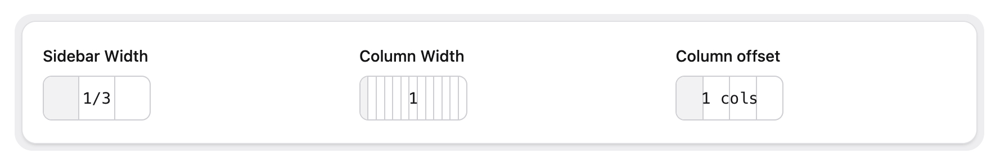
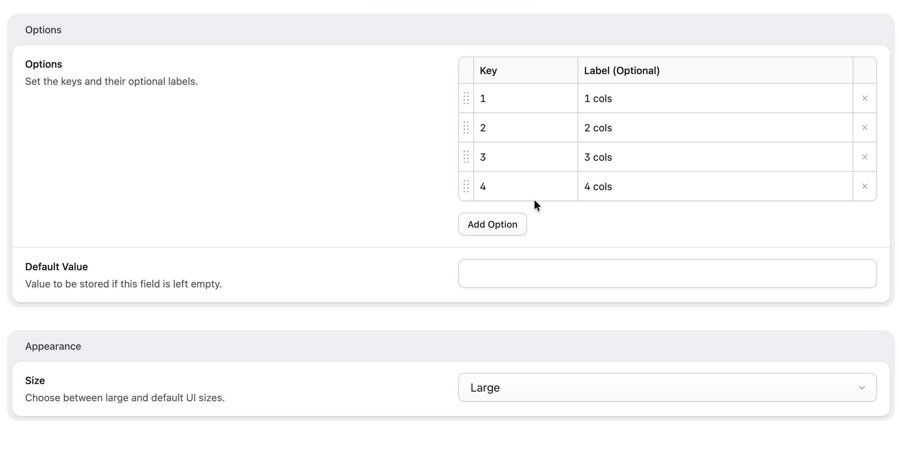

# Flexible Width Fieldtype

<!-- statamic:hide -->

<!-- /statamic:hide -->

> The Flexible Width Fieldtype for Statamic allows easy control of any content area or media element width. It offers more flexibility than the default "Width" Fieldtype, supporting any key-value pairs.



## How to Install

Run the following command from your project root:

``` bash
composer require o1y/statamic-flexible-width
```

## How to Use

To use the Flexible Width Fieldtype, navigate to the "Buttons & Controls" section in the Blueprint configuration. Add your custom key-value pairs.



Alternatively, edit the Blueprint directly in your `.yaml` file:

```yaml
-
  handle: column_width
  field:
    type: flexible_width
    display: 'Column Width'
    options:
      col-1: 1/3
      col-6: 2/3
      col-12: 3/3
```

Use the augmented value in your template:

```html
<div class="{{ column_width }}">
  <p>My column</p>
</div>
```

## Credits

This addon is inspired by the built-in [Width Fieldtype](https://statamic.dev/fieldtypes/width) in Statamic. 
